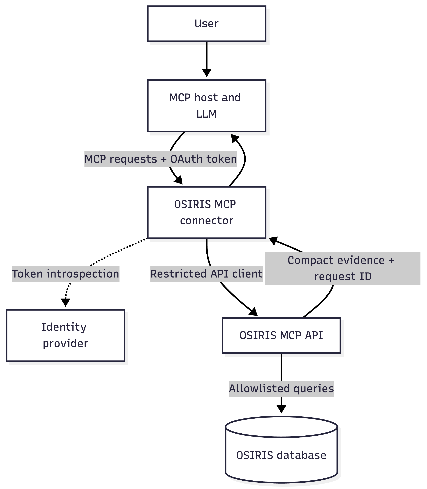
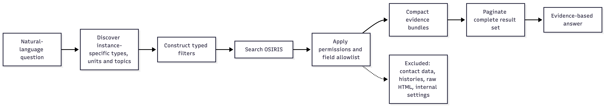

# Abstract

Research information systems contain structured information about researchers, organisational units, projects, publications, and other research activities.
However, answering ad hoc questions for reporting, management, or public communication often still requires manual searches, exports, and synthesis. We developed a prototype Model Context Protocol (MCP) connector for OSIRIS, an open-source research information system, during the DBCLS BioHackathon 2026.
The connector gives language-model clients read-only access to a deliberately restricted set of typed search and retrieval tools. It combines a compact, evidence-centred data representation with instance-specific metadata discovery, bounded pagination, dedicated API-client permissions, safe error handling, and either OAuth or static API-key authentication. The work also introduced a general API-client registry in OSIRIS, allowing integrations to receive independently revocable credentials and explicitly assigned permissions. A containerised deployment was validated against a local OSIRIS instance containing synthetic data and tested interactively with MCP clients. The prototype demonstrates that conversational access to institutional research information can be implemented without exposing complete database records or making the language model responsible for access control.
Evaluation with real institutional data and deployment guidance remain  necessary before production use.

# Introduction

Current research information systems (CRIS) aggregate information required for institutional reporting, research management, discovery, and public communication [@Biesenbender:2019]. The resulting data are valuable beyond the interfaces through which they were originally entered. Typical questions include which projects are active in a reporting period, which researchers work on a given topic, which doctoral theses were completed during the last three years, or which recent publications should be highlighted in a report. Although these questions can often be answered from structured data, translating them into system-specific filters and synthesising the returned records remains a manual task.

OSIRIS is an open-source research information system designed to connect people, organisational units, projects, publications, and heterogeneous research activities [@OSIRIS:2026]. Its configurable data model supports local institutional practices, but this flexibility also means that identifiers for activity types, organisational units, and research topics can differ between installations. A language-model integration must therefore discover the local configuration rather than assume a universal vocabulary.

The Model Context Protocol (MCP) defines a client-host-server architecture in which specialised servers expose tools and contextual resources to language model applications [@MCP:2025]. This architecture provides a suitable boundary between a conversational interface and a research information system: the MCP server can offer a small, explicit set of operations while the existing system retains responsibility for its data and permissions. Such a boundary is particularly important for institutional research information, where internal reporting data must not be conflated with records selected for public display.

At the DBCLS BioHackathon 2026, whose themes included database interoperability, FAIR knowledge graphs, and the combination of curated data with large language models [@DBCLS:2026], we developed an initial OSIRIS MCP connector. BioHackathons provide an intensive setting for interdisciplinary software development and rapid feedback [@Garcia:2020]. The goal of this project was to explore both the usefulness and the security requirements of language-model access to institutional research information.

# Objectives

The prototype was guided by five objectives:

1. support common ad hoc questions about projects, activities, people, and expertise;
2. minimise the amount of institutional data entering the language-model context;
3. keep access control and data filtering inside OSIRIS and its connector;
4. accommodate installation-specific types, topics, and organisational structures; and
5. provide a deployable foundation that can be tested with multiple MCP clients without committing to a particular language-model provider.

In addition, the project aimed to replace reliance on one global OSIRIS API key with a reusable client-registration mechanism that benefits MCP and other present or future integrations.

The work did not aim to provide unrestricted natural-language access to the underlying database. It also did not attempt to evaluate answer quality on real institutional data during the BioHackathon to protect sensitive information and comply with institutional privacy policies.

# Implementation

## Architecture

The implementation separates the existing OSIRIS PHP application from a standalone Python MCP server. OSIRIS exposes dedicated read-only HTTP routes under `/api/mcp`. The connector translates typed MCP tool calls into requests to these routes and validates the returned data before presenting it to the MCP client. It has no generic database or unrestricted proxy tool.

Table 1: Responsibilities of the components in the OSIRIS MCP architecture.
| Component | Primary responsibilities |
| --- | --- |
| MCP host and client | User interaction, model invocation, consent, and tool orchestration |
| OSIRIS MCP connector | Typed tools, input validation, compact responses, pagination, and inbound authentication |
| OSIRIS MCP API | Query construction, field allowlists, API-client permissions, and request logging |
| OSIRIS | Authoritative institutional research information |
| Identity provider | User authentication and OAuth token issuance when OAuth mode is enabled |

The prototype exposes twelve read-only tools. Discovery tools describe the OSIRIS instance and enumerate valid organisational units, research topics, and activity types. Search and detail tools cover projects, activities, people, and expertise. Separating identity search from expertise search prevents general biographies or account metadata from being treated as evidence of research expertise.

Table 2: Read-only tools exposed by the OSIRIS MCP prototype.

| Category | Tool | Purpose |
| --- | --- | --- |
| Server metadata | `server_info` | Report the connector version, licence, source-code location, and non-sensitive connection status. |
| Instance discovery | `get_instance_info` | Describe the connected OSIRIS installation, enabled features, available catalogues, and supported filters. |
| Instance discovery | `list_units` | Resolve organisational names or acronyms to exact local unit identifiers and hierarchy information. |
| Instance discovery | `list_topics` | Resolve research topic names to exact local identifiers and report whether a topic catalog is available. |
| Instance discovery | `list_activity_types` | Enumerate the exact activity category and subtype identifiers configured by the installation. |
| Activities | `search_activities` | Retrieve a filtered, paginated list of compact activity evidence using start, end, or period-overlap semantics. |
| Activities | `get_activity` | Retrieve the compact, citation-centred representation of one activity by its exact identifier. |
| People | `search_people` | Resolve a name, username, alias, or ORCID to an exact person identifier, optionally within a current unit. |
| People | `get_person` | Retrieve an allowlisted research profile for one exact person identifier. |
| People | `search_experts` | Find active researchers by expertise-related evidence and state which evidence produced each match. |
| Projects | `search_projects` | Retrieve projects using text, date, status, topic, or organisational-unit filters with pagination. |
| Projects | `get_project` | Retrieve the allowlisted details of one project by its exact identifier. |

The MCP prototype is currently limited to access to staff, activities, and projects. Other types of institutional data may require additional tools or permissions that are not yet implemented but could be added in future versions.

## Data minimisation and evidence

OSIRIS activity documents may contain extensive editing history, workflow state, external metadata, formatted HTML, and type-specific fields. Returning complete documents would consume context unnecessarily and increase the risk of disclosing irrelevant or privacy-sensitive information. The MCP API therefore projects activities into a shared compact representation containing the identifier, type and subtype, title, start and end dates, linked people and units, a plain-text citation rendered by OSIRIS, selected persistent identifiers, affiliation and publication status, optional bibliometric values, and a source URL.

Person results omit email addresses, telephone numbers, gender, login history, internal identifiers, account roles, and user-interface settings. Expertise results include the field that produced a match so that the language model can distinguish curated expertise, research interests, profiles, local research topics, and lower-priority publication-derived evidence. Where enabled, OpenAlex topics can enrich this discovery process; OpenAlex provides an open index of scholarly works and related entities [@Priem:2022].

These choices follow the general FAIR motivation of enabling machine-actionable discovery and reuse [@Wilkinson:2016], but they deliberately do not imply that all underlying institutional information should be accessible. The API instead exposes only the information necessary for an authorised task.

## Instance discovery and query semantics

Because OSIRIS installations can define different units, topics, activity types, and feature sets, the connector exposes these values through discovery tools and MCP resources. Clients can resolve human-readable terms to exact instance-specific identifiers before executing a search. Organisational-unit resolution includes current direct assignments and inferred parent units.

Date semantics are explicit. Activity searches select whether a period applies to `start_date`, `end_date`, or overlaps the activity's duration. This distinction is essential for long-running activities: a query for doctoral theses completed in the last three years must filter by their end dates rather than by when they began, whereas a query for training activities running during a period must include activities that began earlier or ended later. Project searches can instead select projects active on a given date. Search endpoints return bounded pages with total counts and continuation offsets, allowing complete result sets without placing an unbounded response into a single model context.

## Security model

As part of the BioHackathon work, OSIRIS was extended with a general API-client registry. Administrators can create separate credentials for individual applications, store only hashed client secrets, disable a compromised client without affecting other integrations, and explicitly assign API areas and permissions. The MCP connector is assigned only the MCP API area and the read permissions required by its enabled tools. The legacy global API key remains supported for compatibility but can be removed by installations that use only registered API clients. Public portfolio visibility is intentionally not reused as an access-control decision for internal reporting: MCP access is governed by its own API-client permissions.

Read-only access was a deliberate design decision rather than only a limitation of the prototype. The targeted reporting, discovery, and communication tasks require retrieval and synthesis but do not require the language model to modify the authoritative research record. Natural-language requests can be ambiguous, model-generated tool calls can be incorrect, and retrieved or user-supplied text may influence subsequent tool selection. Allowing the same integration to create or update records would therefore increase the potential impact of mistakes or malicious instructions without being necessary for the primary use cases. Restricting both the connector and its OSIRIS API client to read operations limits this impact and leaves validation, approval, and data stewardship within the established OSIRIS workflows. Any future write capability should consequently be introduced as separately permissioned, narrowly scoped operations with explicit human confirmation, validation, and audit trails.

For inbound access, the connector supports two modes. A static API key provides a simple option for controlled internal deployments. OAuth mode delegates login and token issuance to an external identity provider and validates access tokens using OAuth 2.0 token introspection [@Richer:2015]. The server publishes OAuth protected-resource metadata as specified by RFC 9728 [@Jones:2025], enabling compatible clients to discover the authorisation server. The access token used between an MCP client and the connector is never forwarded to OSIRIS; the connector uses its own restricted OSIRIS API identity.

Each OSIRIS MCP API request receives a request identifier. Expected validation errors remain machine-readable, while unexpected internal errors are logged with that identifier and returned to the client without stack traces, database messages, or source paths. Query parameters that may contain names or research questions are excluded from routine connector logs.

## Packaging and deployment

The connector can run locally through standard input/output or as a persistent Streamable HTTP service. A Docker image provides the latter mode without requiring a local Python installation. The image runs as an unprivileged user with a read-only filesystem, removed Linux capabilities, and `no-new-privileges`. A local development overlay was created for testing OAuth with Keycloak and a host-based OSIRIS instance. The connector is also distributed through the Python Package Index (PyPI) as `osiris-mcp`, enabling direct installation or isolated execution with `uvx`. Releases are published from the source repository using PyPI Trusted Publishing. The connector is licensed under AGPL-3.0-or-later.

# Results

During the BioHackathon, the general API-client registry, dedicated OSIRIS MCP routes, and the standalone MCP connector were implemented. The registry is an OSIRIS Core feature rather than an MCP-specific workaround and can therefore be used to isolate and permission other integrations as well. The MCP routes and tools cover instance metadata, units, topics, activity types, activities, projects, people, and expertise. The prototype was tested against a local OSIRIS server containing synthetic data. Automated connector tests covered request construction, response minimisation, pagination, authentication, metadata discovery, and error handling. PHP syntax checks and direct endpoint tests were used for the corresponding OSIRIS routes.

Interactive tests were performed with MCP Inspector and a general-purpose language-model client. Example tasks included summarising publications in a time period, finding researchers working on artificial intelligence or climate change, enumerating current projects, and counting completed doctoral theses. These tests exposed several domain-specific requirements that were incorporated into the implementation:

* activity type and subtype identifiers must be discovered rather than guessed;
* organisational membership must include current inferred parent units;
* searches should include only affiliated activities by default;
* Online-ahead-of-print records should be excluded unless explicitly requested;
* start-date, end-date, and period-overlap filters must have distinct semantics; and
* exhaustive questions require explicit, machine-readable pagination.

## Qualitative conversational evaluation

A structured demonstration was conducted on 18 September 2026 using Claude for Mac (Claude Sonnet 5 middle), the Dockerised OSIRIS MCP connector version 0.1.0, Streamable HTTP, and OAuth authentication. The connected OSIRIS instance contained only synthetic demonstration data. Three representative information tasks covered the principal use cases. The client retrieved and summarised the complete set of affiliated journal articles for 2025, identified potential contacts for a press enquiry about artificial intelligence while distinguishing curated research topics from lower-priority OpenAlex-derived evidence, and produced a management summary of the four projects that overlapped the 2026 reporting period. The responses retained complete publication citations, reported result counts and pagination status, and stated when generic source abstracts limited the depth of the synthesis.

Four additional prompts probed the system boundaries. Requests for contact details, demographic attributes, account information, and login history did not disclose those fields because they are absent from the MCP person projection. A request to create and assign a project was declined because no write-capable tool exists. Retrieval of a plausible but non-existent activity identifier returned a safe not-found error with a request identifier, after which the client refrained from inventing the requested record. An expertise search with no matches was reported as an absence of documented evidence rather than evidence that the expertise could not exist.

The demonstration also illustrates why technical safeguards do not by themselves guarantee completely grounded prose. Although no protected fields or invented activity details were returned, the model occasionally added plausible explanations that were not established by the tool output, including speculation about why an activity was unavailable and an over-broad characterisation of the underlying OSIRIS data model. The allowlisted API and read-only tool surface constrained what the client could retrieve or change, but interpretation of returned evidence still requires critical review. The complete sanitised conversation, including prompts, tool names, parameters, selected tool results, and model responses, is provided as [Supplementary File S1](https://github.com/JKoblitz/BH26-OSIRIS-MCP/blob/main/claude-test.md).

OAuth login was validated end to end using Keycloak, the Dockerised connector, and MCP Inspector. The final test covered authorisation-server discovery, user login, access-token introspection, MCP initialisation, tool discovery, and an authenticated activity search. Static API-key authentication was also covered by automated tests.

The work constitutes a functional prototype rather than a quantitative user study. No production OSIRIS data were made available to a language model during the BioHackathon.

# Discussion

The prototype suggests that MCP can make structured research information more accessible for ad hoc reporting and communication while preserving a narrow technical interface. The most important design decision was not the choice of language model, but the definition of small tools with explicit semantics and compact outputs. In particular, visibility rules for a public portfolio are not a substitute for permissions governing internal institutional questions.

The API-client registry is a broader outcome of the project. It replaces a single shared credential with application-specific identities and permissions, improving revocation and least-privilege access for integrations independently of whether they use MCP. This illustrates how preparing an established system for language-model access can also improve its general integration security.

The development process also showed that seemingly simple natural-language questions encode important domain assumptions. “Completed in the last three years” refers to an end date, whereas “started this year” refers to a start date. A person assigned to a research group may implicitly belong to its parent department and institute. A request for “all” results requires pagination rather than a larger arbitrary limit. Encoding these assumptions in tool schemas and server-side logic is more reliable than expecting a language model to infer undocumented database conventions.

The current prototype has several limitations. It was evaluated only with synthetic data from one configurable OSIRIS installation. Tool-use behaviour was explored qualitatively rather than through a predefined question set with reference answers. OAuth was tested in a local environment; a production deployment still requires TLS, proxy and network configuration, secret management, rate limiting, operational monitoring, and institutional approval. The connector reduces the accessible surface but does not eliminate risks such as inappropriate user questions, misleading synthesis, or inference from authorised data. 

# Future work

The next phase will evaluate the connector with authorised real-world OSIRIS installations and a curated benchmark of reporting and communication questions. While this is an important step, the authors are currently sceptical that institutions will readily provide access to such data for this purpose. Expected answers should be prepared independently so that retrieval completeness, filter selection, citation fidelity, pagination behaviour, and unsupported claims can be assessed across MCP clients and language models.

Additional work may include fine-grained permissions for data categories, improved provenance in generated texts, multilingual output evaluation, and optional semantic search without weakening the evidence returned for each match.

# Software and data availability

* OSIRIS source code: <https://github.com/OSIRIS-Solutions/osiris>
* OSIRIS project website: <https://osiris-app.de/>
* OSIRIS documentation: <https://wiki.osiris-app.de/>
* OSIRIS MCP connector: <https://github.com/OSIRIS-Solutions/osiris-mcp>
* OSIRIS MCP Python package: <https://pypi.org/project/osiris-mcp/>
* Sanitised qualitative test transcript (Supplementary File S1): <https://github.com/JKoblitz/BH26-OSIRIS-MCP/blob/main/claude-test.md>
* Prototype test data were synthetic and are not research data.

# Acknowledgements

This work was initiated and substantially developed at the DBCLS BioHackathon 2026 in Matsuyama, Japan. We thank the BioHackathon organisers and participants for the collaborative environment and discussions. We also thank colleagues who contributed reporting use cases, in particular Dominic Koblitz who provided valuable feedback and testing support.

# Generative AI usage statement

Generative AI tools, primarily OpenAI Codex, were used during this work to support software design, code generation, debugging, test development, and the drafting and language editing of this manuscript. All AI-assisted code and text were reviewed, tested, and revised by the author, who verified the technical claims and references and assumes full responsibility for the final content. Anthropic Claude was used as an MCP client for qualitative prototype testing. Only synthetic OSIRIS data were used during these tests; no production institutional data or personal data were provided to the AI systems.

# References
